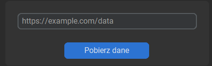
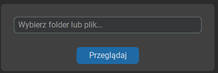
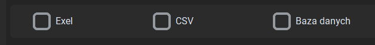
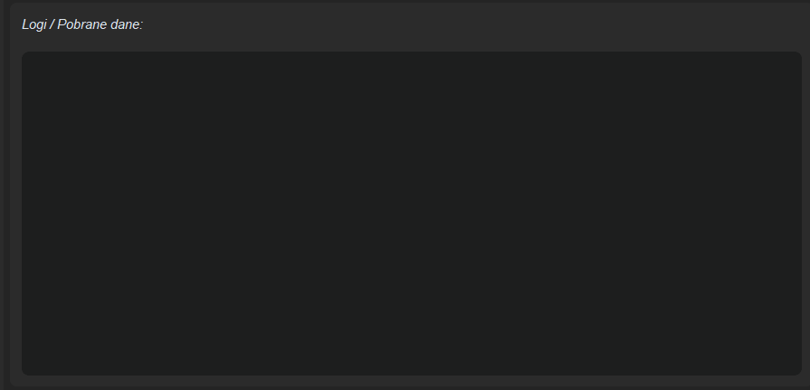

# 🚀 CRM – narzędzia Python

> Projekt przedstawiający funkcjonalny **dashboard z GUI**, który integruje różne narzędzia automatyzujące pracę z danymi.

[]()
[](LICENSE)

---

# 🧐 O projekcie

**Scraper GramWzielone** to narzędzie umożliwiające automatyczne pobieranie danych firm ze strony:

https://www.gramwzielone.pl/baza-firm

Zebrane dane mogą zostać zapisane w formacie **Excel lub CSV**, co pozwala na dalszą analizę lub wykorzystanie w procesach sprzedażowych i marketingowych.

Projekt jest częścią większego systemu **CRM Dashboard**, który docelowo będzie zawierał więcej modułów automatyzujących pracę z danymi.

---

# 📊 Zakładka Dashboard

Główna zakładka aplikacji zawierająca najważniejsze informacje o systemie.

Aktualnie dostępny jest moduł sprawdzający **status strony**, który uruchamia się automatycznie podczas startu aplikacji.

---

# 🔎 Zakładka Scraper

Moduł umożliwiający scrapowanie danych firm ze strony:

https://www.gramwzielone.pl/baza-firm

Aby rozpocząć scrapowanie:

1. Skopiuj link z dowolnej podstrony bazy firm.
2. Wklej go do pola w aplikacji.
3. Wybierz lokalizację zapisu.
4. Wybierz format pliku.
5. Uruchom proces scrapowania.

---

# 🖥 Opis interfejsu

## Pole wklejenia linku

Okno umożliwiające wklejenie linku z którego będą pobierane dane.



---

## Wybór lokalizacji zapisu

Pozwala określić miejsce zapisania wygenerowanego pliku.



---

## Wybór formatu zapisu

Możliwość zapisania danych w formacie CSV i Exel:

* Excel
* CSV
* Baza dnaych (w budowie)



---

## Okno logów

Wyświetla przebieg procesu scrapowania oraz ewentualne błędy.



---

# 🛠 Technologie

Główne technologie użyte w projekcie:

* **Python** – logika aplikacji
* **CustomTKinter** – GUI aplikacji
* **PostgreSQL** – baza danych
* **Requests** – obsługa zapytań HTTP
* **CSV** – generowanie plików z danymi
* **Threading** – obsługa wielowątkowości

---

##\ 🚀 Jak zacząć (instalacja)

## Wymagania

Przed uruchomieniem projektu upewnij się, że masz zainstalowane:

* Python 3.10+
* Git

---

## Instalacja

### 1. Sklonuj repozytorium

```bash
git clone https://github.com/Lukas-Falko/CRM.git
cd CRM
```

### 2. Zainstaluj zależności

```bash
pip install -r requirements.txt
```

### 3. Uruchom aplikację

```bash
python main.py
```
